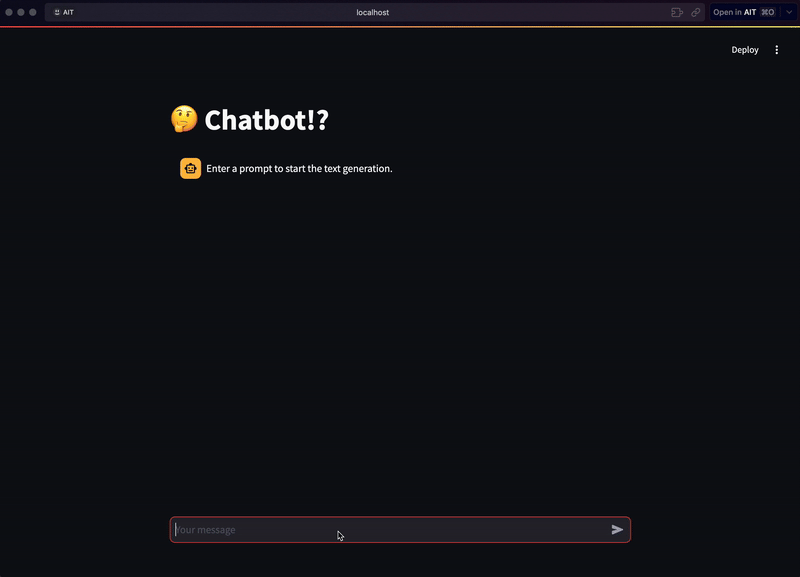

# Input Dataset

This model was trained using the RealNews dataset, a processed version of Google's C4 dataset, which can be accessed via Hugging Face at [allenai/c4](https://huggingface.co/datasets/allenai/c4).

### About the RealNews Dataset
The RealNews dataset was introduced by Zellers et al. in their paper, Defending Against Neural Fake News [arXiv:1905.12616v3](https://arxiv.org/abs/1905.12616v3).

RealNews is a large-scale corpus of news articles sourced from Common Crawl. The dataset is filtered to include only articles from the 5,000 news domains indexed by Google News. The authors utilized the Newspaper Python library to extract the body text and metadata from each article. The training data consists of news articles from Common Crawl dumps spanning December 2016 to March 2019, while articles from the April 2019 dump were reserved for evaluation. After deduplication, the dataset size is approximately 120 gigabytes (uncompressed).

### Dataset Statistics

| Split      | Examples   |
| ---------- | ---------: |
| train      | 13,804,817 |
| validation |     13,855 |

# Model Training

Due to computational resource constraints, only 20,000 samples from the RealNews dataset were used for training. The model was trained using a PyTorch implementation of LSTM-based language modeling, originally developed by Prof. Chaklam Silpasuwanchai.

The final model size is approximately 700MB, which includes the model weights, parameters, and vocabulary files. This size was chosen to ensure portability and ease of use. However, due to the model's size and resource requirements, it is not feasible to deploy the Streamlit-based interface as an online application. 

# Model Inference

For inference, a Streamlit application with a chatbox interface was developed to interact with the trained model. This interface allows users to input text and receive predictions or generated text from the model.

### Demo

